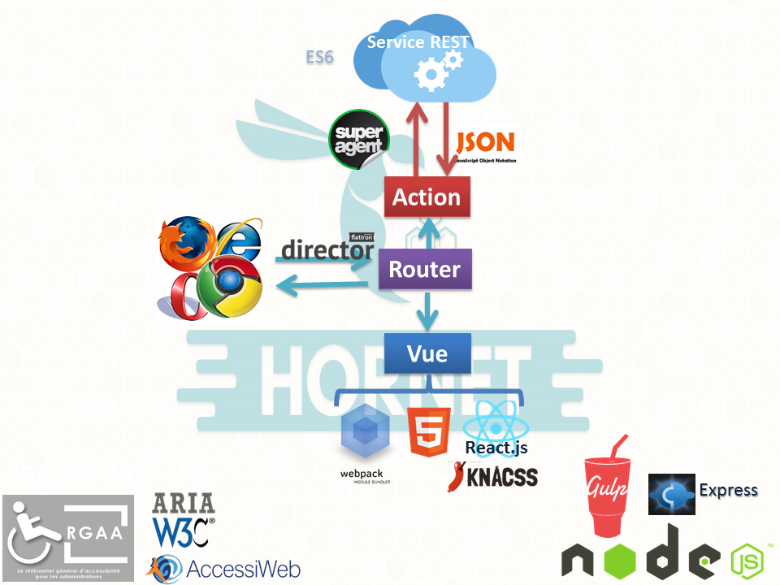
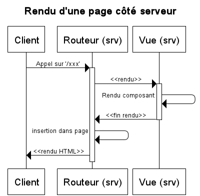
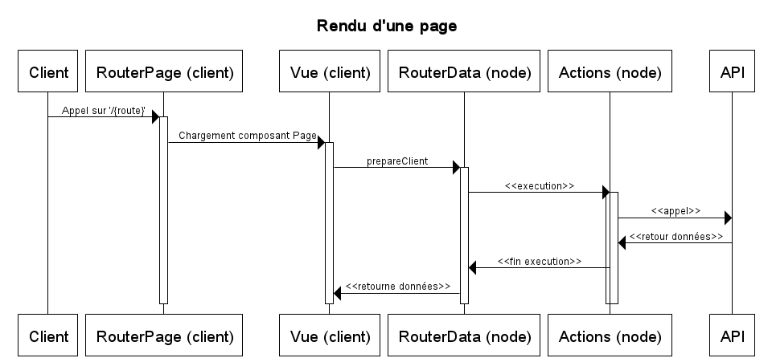
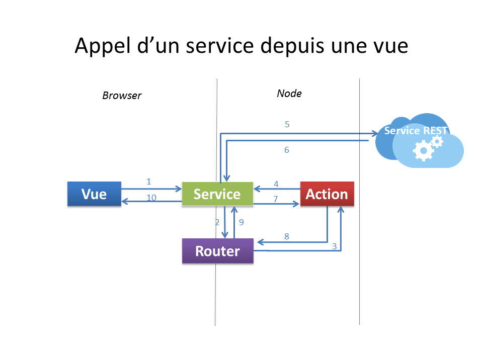
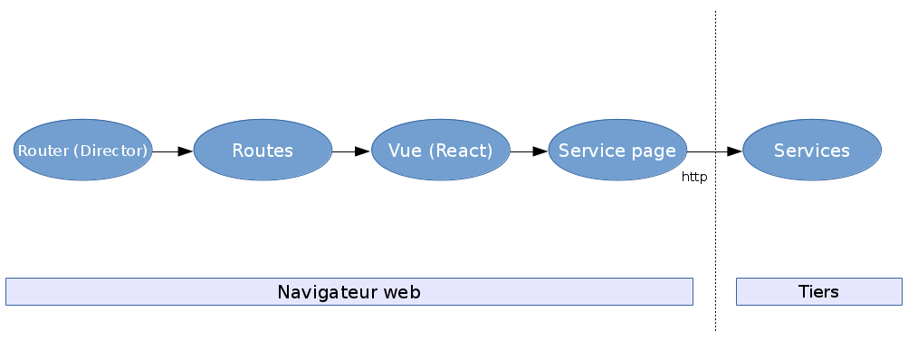
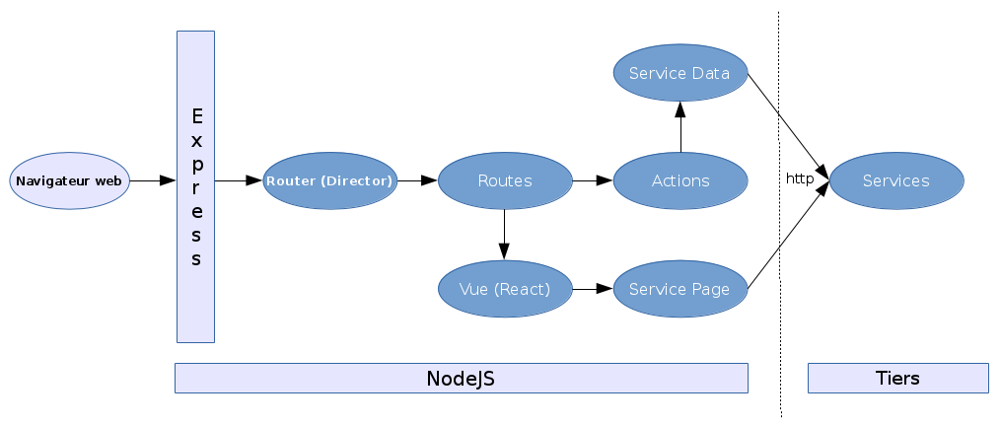

# hornet-js

Le framework `Hornet.js` est un framework open-source conçu pour développer des applications web basé sur le language `typescript`.
Il est conçu selon le principe d'`isomorphisme`, c'est à dire que le code d'une application Hornet s'exécute aussi bien dans un navigateur web que sur un serveur d'application Node.js.

Il permet de répondre aux besoins posés par les référentiels généraux de l'état Français pour les administrations :
* RGS : Référentiel Général de Sécurité
* RGI : Référentiel Général d'Interopérabilité
* RGAA : Référentiel Général d'Accessibilité pour les Administrations

Il se distingue par la mise en place de deux filières  :
* hornet.js
* hornet.js-lite

`Hornet.js` est utilisé pour les applications demandant une forte sollicitation
`hornet.js-lite` s'oriente vers les plus petites applications : faible volumétrie, peu d'utilisateur, ..

Cette dernière offre en terme d'architecture technique un cadre de développement complet sous javascript.
Tandis que `hornet.js` possède une partie service REST en JAVA.

D'un point de vue technique, il est lui-même composé de briques open-source orientées javascript :
* `Node.js` : plateforme logiciel d'exécution du code JavaScript côté serveur
* `Express` : bibliothèque de base pour l'écriture d'application web sur Node.js
* `Director` : composant de gestion du routage des urls sur le serveur
* `React` : bibliothèque de création d'IHM html selon une logique orientée composants
* `Ajv` : bibliothèque JavaScript de validation de formulaires
* `Superagent` : composant JavaScript pour l'exécution d'appels http
* `Webpack` : outil de création de paquetages (JavaScript, CSS, ...) pour les navigateurs web

<br/>



## Prérequis

* NodeJS 6.X
* hornet-js-builder 1.X installé en global:

```shell
    $ npm install -g hornet-js-builder
```

## Initialisation

Récupérer les sources sur projet.

Compiler les sources typescript de `hornet.js`

```shell
    $ hb compile
```

## Utilisation dans un projet

Ajouter au package.json

```shell
  "appDependencies": {
    "hornet-js-components": "5.1.X",
    "hornet-js-core": "5.1.X",
    "hornet-js-ts-typings": "5.1.X",
    "hornet-js-utils": "5.1.X"
  }
```

Puis lancer la commande :

```shell
    $ hb install
```

# Architecture Hornet.js

## Fonctionnement


Principe de fonctionnement du framework en mode isomorphique.

1. Rendu Serveur :
  * L’utilisateur accède à la première page par un appel serveur, le serveur génère une vue de l'application (sans les data).
  * L'utilisateur peut commencer à utiliser l'application
2. Single Page Application (SPA) :
  * Lorsque tous les élements JavaScript sont bien reçus, le client bascule automatiquement en mode SPA.
  * Dans le mode SPA, tout se passe principalement dans le navigateur client (action/mise à jour de l'état de l'écran). Il n’y a alors plus de chargement complet de page (excepté via l'utilisation du `F5` du clavier). Seules les interactions avec le serveur nécessitent des échanges via des flux de type `AJAX` .
  * Ce mode permet une grande interactivité et réactivité des applications web vis à vis de l'utilisateur final.

Les paragraphes suivants présentent de façon plus détaillée les caractéristiques essentielles de la solution.

### Fonctionnement détaillé

Dans le mode SPA, seuls les éléments impactés par un changement de fonction sont modifiés à l’aide de traitements JavaScript, les autres parties, comme l’entête ou le menu, restent inchangées).

Dans ce mode, les traitements sont majoritairement exécutés dans le navigateur client en JavaScript. Les appels aux serveurs servent à interagir avec les données stockées sur le serveur distant (création, consultation, modification, suppression). Ces échanges sont réalisés à l’aide d’appels Ajax.

Cinématique de rendu serveur / SPA :

1. L’utilisateur demande la première page de l'application.
2. L’application retourne un document HTML complet (entête, menu, corps, bas de page). Le mode SPA s’initialise dans le navigateur par l'exécution automatique de JavaScript (initialisation du court-circuit des clics...).
3. En mode SPA, les liens vers les autres écrans (navigation) sont court-circuités et remplacés par des navigations internes avec du code JavaScript. L'accès aux données se fait par la déclaration de routes dites **Data**
  * L’utilisateur demande à accéder à la page suivante en cliquant sur le lien hypertexte correspondant. Le clic ayant été détourné par le mode SPA, le code JavaScript émet un changement de route interne.<br>
  * L’utilisateur demande à accéder à des données, c'est une route *Data* qui est sollicitée. Ce qui soumet un appel AJAX pour récupérer un flux JSON. On met à jour le DataSource ou l'état du composant page, ce qui provoque le rafraîchissement de certains composants de la page grâce à l'utilisation de `Vues`.

Chaque fragment HTML, correspondant aux éléments de page, est conçu sous forme de composant pour être indépendant de son conteneur.


### Diagrammes de séquence

Ci-dessous sont présentés les schémas généraux de déroulements des échanges dans le pattern implémenté dans Hornet en mode SPA (navigateur web) et rendu serveur (serveur NodeJS).

#### Suite des actions pour le rendu côté serveur



#### Suite des actions pour le rendu côté client



# Architecture technique

Le module applicatif de présentation a pour fonction de fournir l'IHM de l'application.

Ce module est développé en technologie JavaScript/TypeScript et s'exécute grâce à Node.js.

Les principaux composants techniques intervenant dans le module applicatif de présentation sont :

* `Node.js` : plateforme logicielle d'exécution du code JavaScript côté serveur
* `Express` : bibliothèque de base pour l'écriture d'applications web sur Node.js
* `Director` : composant de gestion du routage des urls sur le serveur
* `React` : bibliothèque de création d'IHM html selon une logique orientée composants
* `Superagent` : composant JavaScript pour l'exécution d'appels http
* `Webpack` : outil de création de paquetages (JavaScript, CSS, ...) pour les navigateurs web
* `Gulp` : outil pour la création de tâches de développement

## Pattern d’architecture Hornet

Le schéma ci-dessous explique les responsabilités dans les grandes lignes de chaque élément.



### Actions

Les actions portent les traitements de l’application. Leur réalisation est à la charge du développeur de l’application.

Les services externes sont appelés depuis les api afin d’effectuer les traitements demandés par l’utilisateur. Les retours des services externes sont transmis aux actions qui, elles mêmes, les re-dispatchent à la vue.

### Routeur

Ce composant est le point central de la navigation. Il permet de gérer de manière identique la navigation au sein de l’application que ce soit côté client ou côté serveur (nodeJs).

Ce composant est configuré à partir d’un ensemble de « routes » qui viennent faire le lien entre une URL et les actions du pattern décrit ci-dessus.

Le routeur d'Hornet s'appuie sur le composant [Director](http://github.com/flatiron/director).

Les particularités :

* Transmission des données `POST` par une méthode spécifique afin de ne pas modifier l’url du navigateur
* Utilisation du mode « historique » html5 (mode `pushState` à la place de la notation `!#`) afin d’uniformiser les urls entre la partie client et serveur.

Le routeur se décline en 2 parties:

* routerPage: permet de router vers le composant Page associé à la route appelée
* routerData: permet d'exécuter l'action associée à la route appelée

### Vues

Les vues sont les composants servant à produire le code html affiché à l'utilisateur.

Les données permettant d'alimenter la vue doivent être récupérées en utilisant la méthode  `getService` du composant page, au sein de la méthode `prepareClient`. 
La méthode `prepareClient` est déclenchée lorsque le composant Page est monté (à travers la méthode `componentDidMount` propre au [cycle de vie React](https://facebook.github.io/react/docs/react-component.html)).


Les composants de cette brique utilisent le moteur de rendu [React](https://reactjs.org/ ou https://github.com/facebook/react/) :

* Un rendu des composants à partir d’un template JSX/TSX/JavaScript
* Une gestion des évènements permettant un binding unidirectionnel (vue -> modèle).

Les composants graphiques sont implémentés avec la librairie React et les contrôles de surface des formulaires sont décrits avec [ajv](https://github.com/epoberezkin/ajv) 


## Diagrammes  et enchainement des différentes couches

Ci-dessous sont présentés les schémas généraux des différentes couches et de l'enchainement entre elles.

### JS frontend



### JS backend



# Exemple

Un exemple d'implémentation d'application basé sur ce framework est disponible sur https://github.com/diplomatiegouvfr/applitutoriel-modules ainsi qu'une page github https://diplomatiegouvfr.github.io/applitutoriel-online

# Licence

`hornet-js` est sous [licence cecill 2.1](./LICENSE.md).

Site web : [http://www.cecill.info](http://www.cecill.info/licences/Licence_CeCILL_V2.1-en.html)
